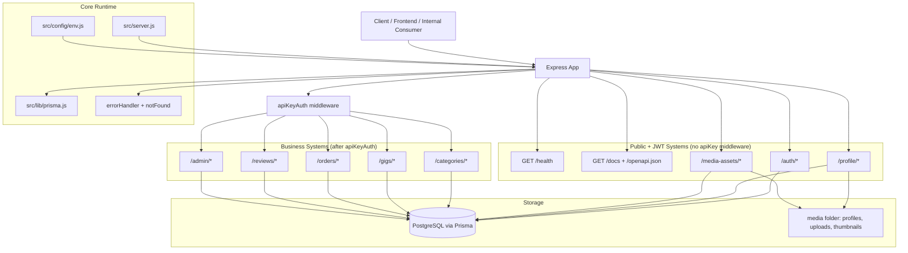
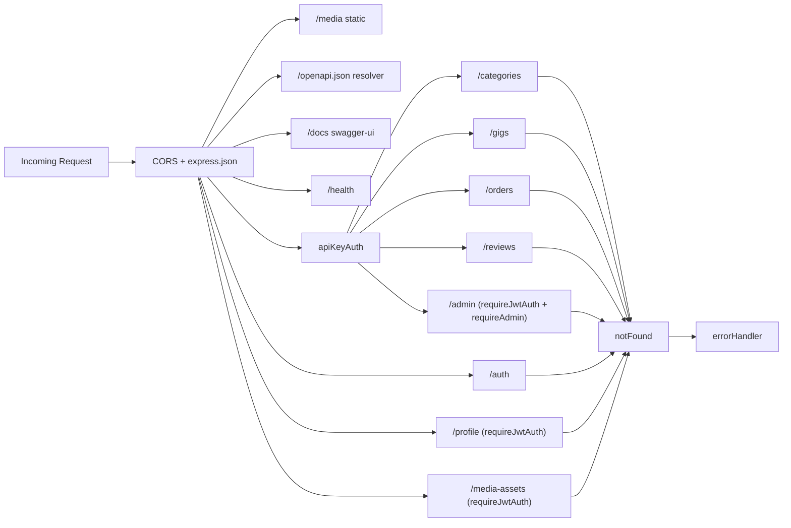
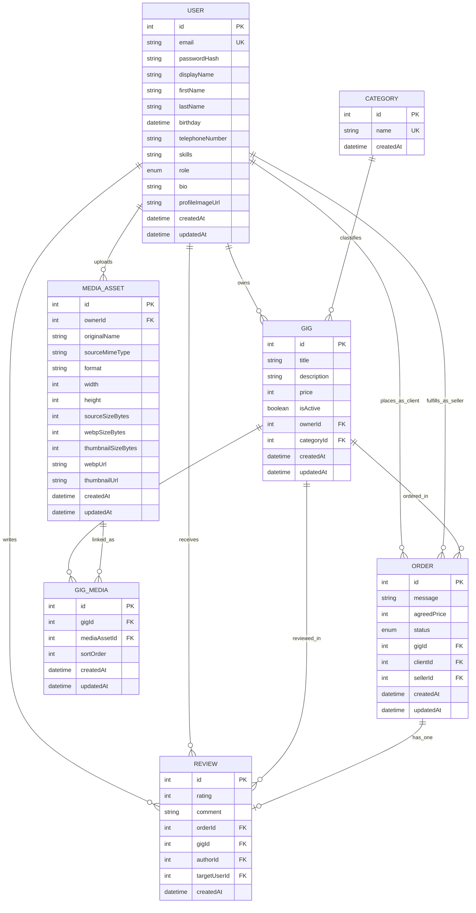
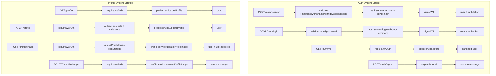
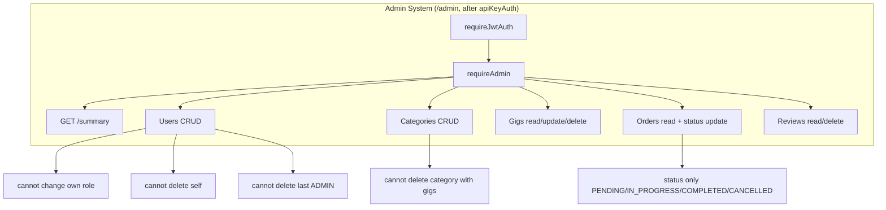
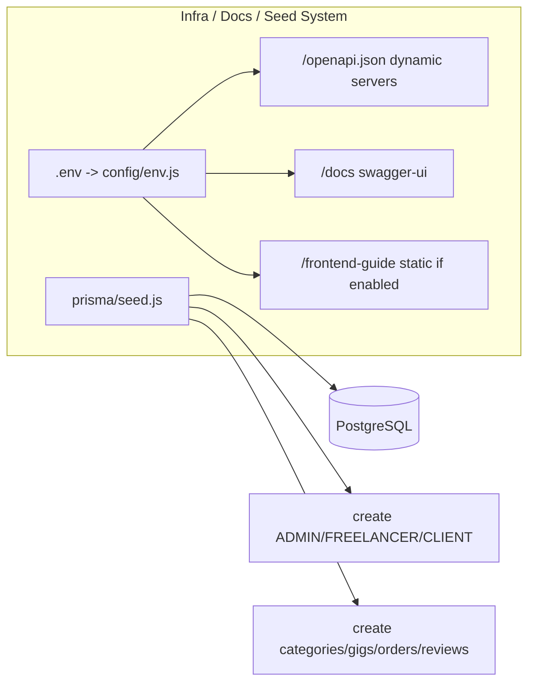

# Backend System Flow (Mermaid)

เอกสารนี้สรุป system flow ของ backend แบบแยกเป็นส่วน ๆ ครบทุกระบบหลัก

## 1) Backend Architecture Overview

## 2) Request Pipeline (App-Level)

## 3) Data Model (Prisma ERD)

## 4) Auth + Profile Flow

## 5) Media Assets + Gig Media Flow

```mermaid
flowchart TB
  subgraph MediaAssetSystem["Media Assets (/media-assets)"]
    Upload[POST /media-assets/upload] --> JwtM1[requireJwtAuth]
    JwtM1 --> MulterMem[uploadMediaAsset memoryStorage]
    MulterMem --> Process[sharp: rotate + convert webp + thumbnail]
    Process --> SaveFiles[write uploads/ + thumbnails/]
    SaveFiles --> SaveDB[create mediaAsset record]
    SaveDB --> Cleanup1[cleanupOrphanMediaFiles]
    Cleanup1 --> UploadDone[201 mediaAsset]

    List[GET /media-assets] --> JwtM2[requireJwtAuth] --> ListDB[listMyMediaAssets] --> ListResp["data list"]
    GetOne[GET /media-assets/:id] --> JwtM3[requireJwtAuth] --> GetDB[getMyMediaAssetById] --> GetResp[data]
    Delete[DELETE /media-assets/:id] --> JwtM4[requireJwtAuth] --> DelFiles[unlink webp+thumb] --> DelDB[delete row] --> Cleanup2[cleanupOrphanMediaFiles] --> DelResp[message]
  end

  subgraph GigMediaSystem["Gig Media (/gigs/:id/media/*)"]
    UpGigMedia[POST /gigs/:id/media/upload] --> JwtG1[requireJwtAuth]
    JwtG1 --> OwnerCheck1[gig.ownerId == req.auth.userId]
    OwnerCheck1 --> CreateAsset[mediaAssetService.createMediaAsset]
    CreateAsset --> LinkGig[create gigMedia + sortOrder]
    LinkGig --> UpGigDone[201 mediaAsset]

    DelGigMedia[DELETE /gigs/:id/media/:mediaId] --> JwtG2[requireJwtAuth]
    JwtG2 --> OwnerCheck2[owner check]
    OwnerCheck2 --> DelLink[delete gigMedia link]
    DelLink --> DelAsset[mediaAssetService.deleteMyMediaAsset]
    DelAsset --> DelGigDone[message]
  end
```

## 6) Marketplace Business Flow (Categories, Gigs, Orders, Reviews)

```mermaid
flowchart TB
  subgraph Marketplace["Business Systems (apiKey protected)"]
    Categories["/categories"]
    Gigs["/gigs"]
    Orders["/orders"]
    Reviews["/reviews"]
  end

  Categories --> CatList[GET listCategories]
  Categories --> CatCreate[POST createCategory]

  Gigs --> GigList[GET list with q/categoryId/isActive]
  Gigs --> GigGet[GET by id + owner/category/mediaLinks]
  Gigs --> GigCreate["POST create (JWT)"]
  Gigs --> GigUpdate["PUT update (JWT + owner)"]
  Gigs --> GigDelete["DELETE (JWT + owner)"]
  Gigs --> GigMediaList[GET /:id/media]

  Orders --> OrderList[GET list with clientId/sellerId/status]
  Orders --> OrderGet[GET by id]
  Orders --> OrderCreate["POST create -> resolve sellerId from gig.ownerId"]
  Orders --> OrderStatus[PATCH /:id/status]

  Reviews --> RevList[GET list]
  Reviews --> RevGet[GET by id]
  Reviews --> RevCreate["POST create -> 1 review per order + rating 1..5"]

  OrderCreate --> DB1[(Order table)]
  RevCreate --> DB2[(Review table)]
  GigDelete --> Cascade1[delete gig + linked media cleanup path]
```

## 7) Admin Flow

## 8) Infra / Docs / Seed Flow

